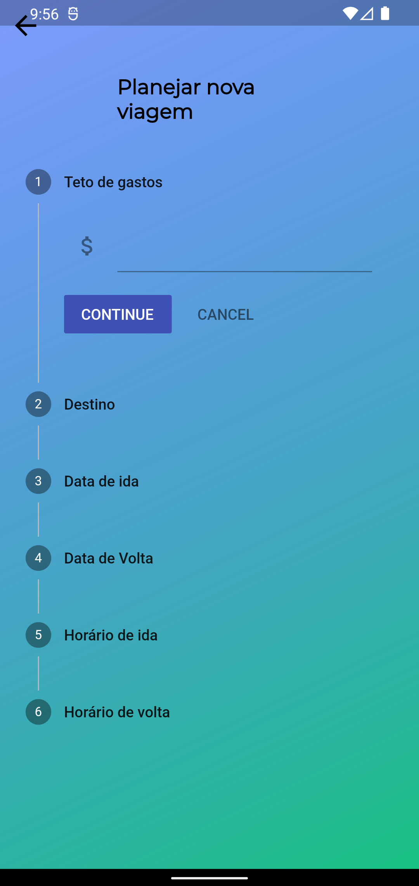
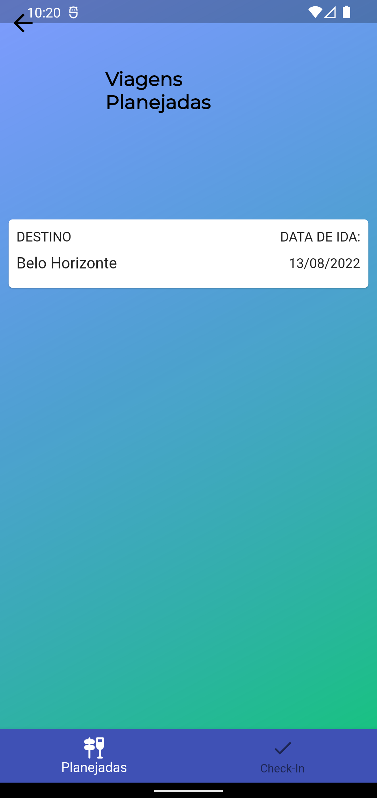
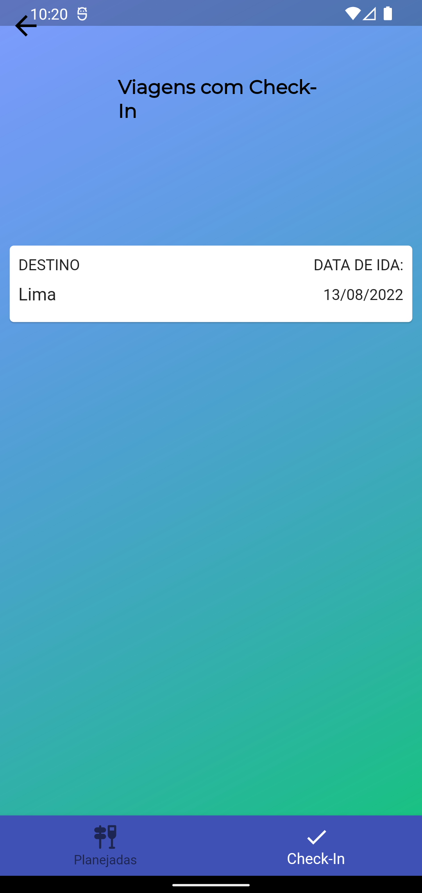

# Cost-Trip

An app to plan trips, using Flutter and Firebase as a database.

## Home || Create Trip pages

Solarized dark             |  Solarized Ocean
:-------------------------:|:-------------------------:
  |  

## All trips || Details trip

 | 


## Packages usage

* flutter_datetime_picker: ^1.5.1
* intl: ^0.17.0
* http: ^0.13.3
* provider: ^6.0.3
* mask_text_input_formatter: ^2.0.0

Add this packages in your Flutter file pubspec.yaml and run 

```
flutter pub get

```
This app uses Firebase as database. Create your database and replace the URLS in the files in the folder 'database'.

